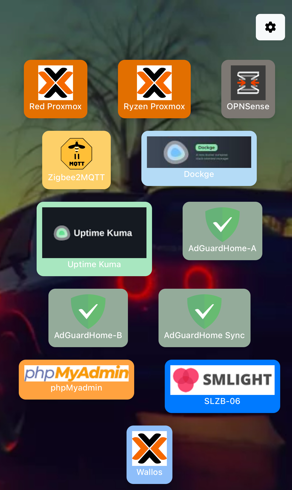

# EaseLab

EaseLab is a customizable web dashboard that allows you to organize your important links in a visual and accessible way. You can add, edit, delete, and reorder links, as well as customize the background with colors, images, or videos.

EaseLab es un dashboard web personalizable que te permite organizar tus enlaces importantes de forma visual y accesible. Puedes añadir, editar, eliminar y reordenar los enlaces, así como personalizar el fondo con colores, imágenes o videos.




## Features / Características

* **Link Management / Gestión de Enlaces:**
    * Add new links with name, URL, color, and an optional icon. / Añade nuevos enlaces con nombre, URL, color y un icono opcional.
    * Edit and delete existing links. / Edita y elimina enlaces existentes.
    * Reorder links using drag-and-drop. / Reordena los enlaces mediante drag-and-drop.
* **Background Customization / Personalización del Fondo:**
    * Change the background color. / Cambia el color de fondo.
    * Set a background image (file upload). / Establece una imagen de fondo (subida de archivos).
    * Use a background video (file upload). / Utiliza un video de fondo (subida de archivos).
* **Intuitive User Interface / Interfaz de Usuario Intuitiva:**
    * Clean and modern design. / Diseño limpio y moderno.
    * Modals for adding, editing, and changing the background. / Modales para añadir, editar y cambiar el fondo.
* **Icon Search / Búsqueda de Iconos:**
    * Integrates a logo search function for easy link customization. / Integra una función de búsqueda de logotipos para facilitar la personalización de los enlaces.
* **Local Storage / Almacenamiento Local:**
    * Links and settings are saved in a SQLite database (`database.db`). / Los enlaces y la configuración se guardan en una base de datos SQLite (`database.db`).

## Technologies Used / Tecnologías Utilizadas

* **Backend:**
    * Python
    * Flask
    * SQLite
    * `requests` and `BeautifulSoup4` for logo search / para la búsqueda de logos
* **Frontend:**
    * HTML5
    * CSS3
    * JavaScript
    * Bootstrap 5
    * SortableJS for drag-and-drop reordering / para el reordenamiento drag-and-drop

## Installation / Instalación

### Option 1: Local Installation / Opción 1: Instalación Local

1.  **Clone the repository / Clona el repositorio:**

    ```bash
    git clone [https://github.com/wepar2/EaseLab](https://github.com/wepar2/EaseLab)
    cd EaseLab
    ```

2.  **Create a virtual environment (recommended) / Crea un entorno virtual (recomendado):**

    ```bash
    python3 -m venv venv
    source venv/bin/activate  # En Linux/macOS
    venv\Scripts\activate  # En Windows
    ```

3.  **Install dependencies / Instala las dependencias:**

    ```bash
    pip install -r requirements.txt
    ```

    * If you don't have a `requirements.txt` file, you can create it with: / Si no tienes un archivo `requirements.txt`, puedes crearlo con:

        ```bash
        pip freeze > requirements.txt
        ```

        * Make sure to run this command after installing the dependencies. Your project's dependencies are: / Asegúrate de ejecutar este comando después de instalar las dependencias. Las dependencias de tu proyecto son:
            * Flask
            * `requests`
            * `beautifulsoup4`
            * `Werkzeug`
            * `python-dotenv`
            * `gunicorn`
4.  **Initialize the database / Inicializar la base de datos:**

    * The `database.db` database will be created automatically when you run the application. / La base de datos `database.db` se creará automáticamente al ejecutar la aplicación.

5.  **Run the application / Ejecutar la aplicación:**

    ```bash
    python app.py
    ```
    o

    Recommended / Recomendado
    
    ```bash
    gunicorn --bind 0.0.0.0:80 app:app
    ```

6.  **Access the application / Acceder a la aplicación:**

    * Open your web browser and visit `http://127.0.0.1:5000` or the address shown in the console. / Abre tu navegador web y visita `http://127.0.0.1:5000` o la dirección que se muestre en la consola.

### Option 2: Docker Hub / Opción 2: Docker Hub

1.  **Pull the image from Docker Hub / Descarga la imagen de Docker Hub:**

    ```bash
    docker pull wepar2/easelab:latest
    ```

2.  **Run the container / Ejecuta el contenedor:**

    ```bash
    docker run -d -p 80:80 wepar2/easelab:latest
    ```

    * This will run the container in detached mode and map port 80 on the host to port 80 in the container. / Esto ejecutará el contenedor en modo detached y mapeará el puerto 80 en el host al puerto 80 en el contenedor.
    * You can access the application at `http://localhost:80` or `http://<your_server_ip>:80`. /  Puedes acceder a la aplicación en `http://localhost:80` o `http://<la_ip_de_tu_servidor>:80`.

### Option 3: Docker Compose / Opción 3: Docker Compose

1.  **Create a `docker-compose.yml` file in the project root / Crea un archivo `docker-compose.yml` en la raíz del proyecto:**

    ```yaml
    version: '3.1'
    services:
      web:
        image: wepar2/easelab:latest
        ports:
          - "80:80"
        restart: always
    ```

2.  **Run Docker Compose / Ejecuta Docker Compose:**

    ```bash
    docker-compose up -d
    ```

    * This will start the application. You can access it at `http://localhost:80` or `http://<your_server_ip>:80`. / Esto iniciará la aplicación. Puedes acceder a ella en `http://localhost:80` o `http://<la_ip_de_tu_servidor>:80`.

## Usage / Uso

* **Add a link / Añadir un enlace:** Click on the "+ Add Link" button to open the modal and fill in the fields. / Haz clic en el botón "+ Añadir Enlace" para abrir el modal y completar los campos.
* **Edit/Delete a link / Editar/Eliminar un enlace:** Activate edit mode by clicking the "Edit" button. "Edit" buttons will appear on each link. / Activa el modo de edición haciendo clic en el botón "Editar". Aparecerán botones de "Editar" en cada enlace.
* **Reorder links / Reordenar enlaces:** In edit mode, you can drag and drop links to change their order. / En el modo de edición, puedes arrastrar y soltar los enlaces para cambiar su orden.
* **Change the background / Cambiar el fondo:** Click on the "Change Background" button to open the modal and select the background type and its value. / Haz clic en el botón "Cambiar Fondo" para abrir el modal y seleccionar el tipo de fondo y su valor.

## Project Structure / Estructura del Proyecto

```text
EaseLab/
├── app.py
├── templates/
│   └── index.html
├── static/
│   ├── styles.css
│   ├── script.js
│   ├── img/
│   └── uploads/
└── database.db

```

## Contribution / Contribución

Contributions are welcome. If you find bugs or have suggestions for improvements, please open an issue or submit a pull request on GitHub.

Las contribuciones son bienvenidas. Si encuentras errores o tienes sugerencias de mejora, por favor, abre un "issue" o envía un "pull request" en GitHub.

## Author / Autor

* Tapetaldev

## License / Licencia
This project is licensed under the Apache License 2.0 - see the [LICENSE.md] file for details.

Este proyecto está licenciado bajo la Apache License 2.0 - ver el archivo [LICENSE.md] para más detalles.